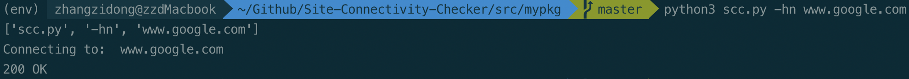
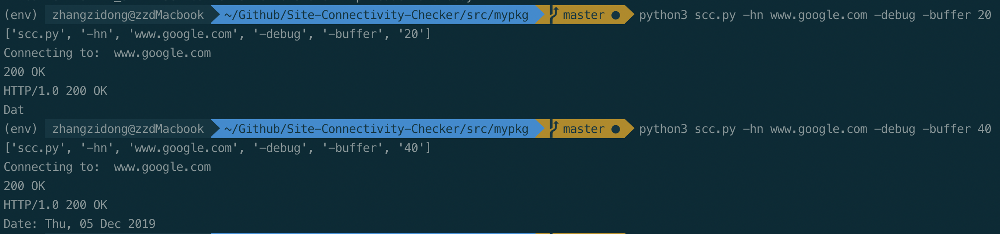

# Site Connectivity Checker (command line tool)
[](https://travis-ci.com/zzdqqqq/Site-Connectivity-Checker)


## Motivation
When you visit a URL, you expect to get the requested pages on your browser. But this is not always the case. Sometimes, sites can be down, so you won’t get the desired results. You can keep trying until it comes up.

This project build a command line tool to automatically do this work.

## TODO
- [x] Conenct to a website by TCP protocol (Compared to ICMP TCP can get more information)
- [x] According to the status codes, return true or false (or some other status)
- [ ] Run this command in background using "systemd". When the site response, send a alert.

## Run
```bash
virtualenv env
source ./env/bin/activate
pip install -r requirements.txt
python3 scc.py -hn "www.google.com"
```

## Help
```bash
python3 scc.py -h
```
Check all available options.
```
  -h, --help              show this help message and exit
  -hn ["HOST_NAME"]       python3 scc.py ['host name']
  -debug                  debug mode
  -save                   save HTTP header file
  -buffer [BUFFER_SIZE]   set buffer size to store http header and body
```

## Example
```bash
python3 scc.py -hn www.google.com 
```

```bash
python3 scc.py -hn www.google.com -debug -buffer 40
```

